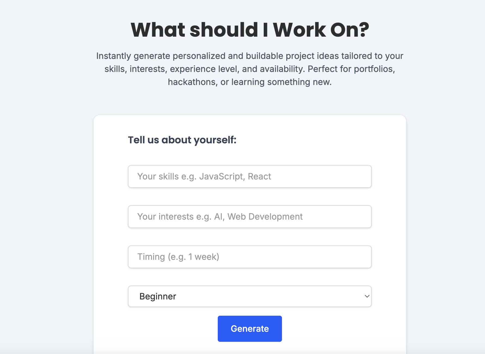

# 💡 What Should I Work On?

Instantly generate personalized and buildable project ideas tailored to your skills, interests, experience level, and availability.

---

## 🚀 Inspiration

This project was built as part of the **Boot.dev Hackathon** and inspired by my own journey as a self-taught developer.

Throughout my learning experience, I often found myself spending more time searching for unique and meaningful project ideas than actually building them. I created this tool to help learners like myself cut through the noise and get inspired faster — whether you're prepping a portfolio, hacking at a hackathon, or just trying to learn something new.

---

## ✨ Features

- Personalized project ideas based on:
  - Your tech stack
  - Interests
  - Availability
  - Skill level
- Clean and responsive UI (built with React + Tailwind CSS)
- Smooth user feedback with toasts and loading indicators
- AI-generated ideas using OpenAI's GPT-3.5
- Deployed and ready for anyone to use (link coming soon!)

---

## 📸 Preview

## 🧪 Example Inputs

- **Skills:** JavaScript, React
- **Interests:** AI, Developer Tools
- **Time Available:** 1 week
- **Experience Level:** Intermediate

---

## 📸 Live Demo

👉 [Click here to try it live](https://project-idea-generator-frontend.onrender.com/)

---

## 🧠 Tech Stack

- **Frontend:** React + Tailwind CSS
- **Backend:** Node.js + Express
- **AI:** OpenAI GPT-3.5 API
- **Hosting:** Coming soon!

---

## 🙌 Acknowledgements

- **[Boot.dev](https://boot.dev)** – for organizing the hackathon that sparked this idea
- **[OpenAI](https://openai.com)** – for the powerful LLM API
- **[Tailwind CSS](https://tailwindcss.com)** – for quick and beautiful styling

---

## 🙌 Author

Made by **Abraham Deeb**  
Feel free to connect or contribute!
